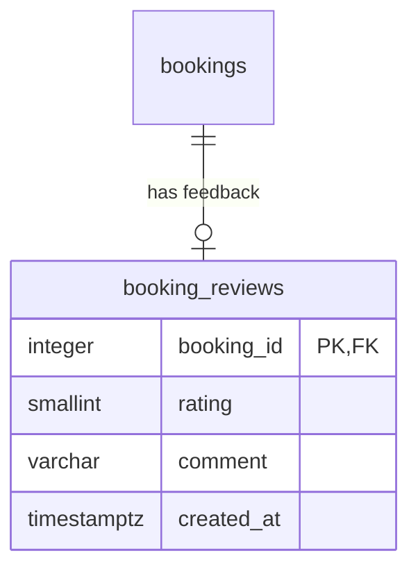

# ML Service

See the top-level repo README for the full picture. This folder is
self-contained: it can be run independently of frontend/database work.

- `feature_engineering.py` — turns a booking request into model features
- `finalize_model.py` — trains/retrains the tuned XGBoost pipeline
- `api.py` — FastAPI service (`/predict`, `/recommend`)
- `models/` — trained model artifact (gitignored, regenerate via finalize_model.py)
- `results/` — evaluation outputs for documentation

## Reference data source

`load_reference_data()` reads areas/providers/traffic/availability from
PostgreSQL/PostGIS (see `database/schema.sql` + `database/migrate_csv_to_postgres.py`),
using the same `DB_HOST` / `DB_PORT` / `DB_NAME` / `DB_USER` / `DB_PASSWORD` env
vars as the migration script:

```bash
export DB_HOST=localhost
export DB_PORT=5432
export DB_NAME=nairobi_recommender
export DB_USER=postgres
export DB_PASSWORD=your_password
```

If no database is reachable, it falls back to the `data/raw/*.csv` files so
prediction previews can still run without Docker/Postgres. Booking, profile,
review and recommendation responses require PostgreSQL (recommendations read
current ratings rather than serving stale imported values).

## Result filters (#79)

`POST /recommend` and `POST /recommend/new-providers` accept three optional
fields: `max_hourly_rate_ksh` (integer, at least 1), `min_rating` (1 to 5) and
`verified_only` (boolean). They are applied after ranking and before the
`top_n` cut, so they remove providers without changing any score or the
order, and a match ranked below the unfiltered top N is still returned.
`min_rating` compares current ratings and excludes providers with no rating.
When nothing matches, the response is `200` with an empty list (`404` still
means no provider offers the service or none is available). Each ranked
provider also reports `is_verified`.

## Cancellation reasons (#81)

Apply `database/migrations/004_cancellation_reasons.sql` to existing databases
**before** running this API version (booking queries select the new columns).
It is safe to rerun.

`PATCH /bookings/{id}/status` accepts an optional `reason` (up to 300
characters) with `status: "cancelled"`. It is required when the booking was
already confirmed and optional when a pending request is declined or
withdrawn; a missing required reason, or a reason on any other transition,
returns `422`. The booking then reports `cancelled_by` (`client` or
`provider`) and `cancellation_reason`, and the other party's notification
ends with the reason. Bookings cancelled before the migration keep both
fields `null`.

## Post-job reviews (#77)

Apply `database/migrations/003_booking_reviews.sql` to existing databases
**before deploying this API version**. For local Docker, with the `PGPASSWORD`
environment variable set:

```bash
psql -h localhost -p 5433 -U postgres -d nairobi_recommender \
  -v ON_ERROR_STOP=1 -f database/migrations/003_booking_reviews.sql
```

Run this command from the repository root. Fresh installations use
`database/schema.sql`, which already includes the table. The migration is
additive and rerunnable; it does not create reviews for imported data. For
Neon, test the migration on a development branch and use its direct connection
for migration, then apply to the deployment database before releasing the API.

`POST /bookings/{booking_id}/review` accepts:

```json
{"client_id": "C0501", "rating": 4, "comment": "Clear communication."}
```

- Rating must be an integer 1–5. Comment is optional, trimmed, at most 1000 characters.
- Only the booking's client can submit, and only after completion. This uses
  the existing **claimed client ID**, not authenticated sessions.
- One immutable review per booking: duplicates and non-completed bookings
  return 409, wrong client 403, missing booking 404, invalid input 422.
- Returns the updated booking; `GET /bookings` includes `review` for both
  participants. Clients submit from My Bookings; providers see feedback in Jobs.
- The review, provider's rounded mean rating, and notification commit together.
  Booking and provider row locks serialise conflicting updates.
- The first real review replaces the imported rating. Later ratings are the
  mean of **live reviews only**. No weighting by synthetic `total_jobs`.
  `review_count` distinguishes live reviews from imported dataset ratings.
- Recommendations fetch ratings in one batched DB query per response, so all
  API workers see committed updates without restarting. Previously saved search
  results remain a snapshot; a new search gets current ratings.
- Reviews never write to `historical_bookings` or alter model inputs. Updating
  live completion-rate history is a separate follow-up from review ratings.

Schema addition (the earlier diagram exports predate reviews):



Verification from the repository root, with `DB_*` set to a **local** database:

```bash
RUN_DB_TESTS=1 ml-service/.venv/bin/python -m pytest tests/ml-service -q
```

The review integration tests create and drop isolated schemas; they exercise
constraints, concurrent submissions, ownership/state checks, aggregation and
transaction rollback. With the local API/frontend running, run
`npx playwright test reviews.spec.ts` from `tests/e2e` for the two-role browser flow.
